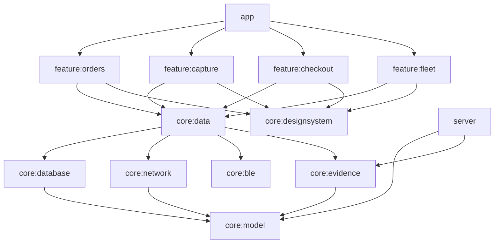

# ProofDrop

**Tamper-evident proof of delivery for Android.** Couriers photograph each drop-off. The app hashes the photo, tags it with GPS and an optional BLE beacon check, and seals it into an append-only hash chain. Any later edit, deletion or photo swap is caught on the device and again by the server.

The app also covers the rest of a courier's shift: device check-out by QR code, a live fleet dashboard over WebSocket, and new orders pushed over Server-Sent Events. Everything works offline and syncs later.

> The same chain-of-custody idea that digital-evidence systems use, applied to last-mile delivery.

[](https://github.com/Penz7/proofdrop/actions/workflows/ci.yml)

---

## Features

| | What it does | Tech |
|---|---|---|
| 📸 **Proof capture** | Full-screen camera. The photo goes to app-private storage and is SHA-256 hashed by streaming | CameraX (`LifecycleCameraController`) |
| ⛓️ **Evidence ledger** | Each record stores the hash of the previous one. "Verify" re-hashes every photo and link and points to the exact record that was tampered with | Pure-Kotlin `core:evidence`, fully unit-tested |
| 📡 **BLE beacon verification** | While the camera is open, the app scans for the drop-off beacon (e.g. an ESP32 advertising `PD-BEACON-01`). A strong enough RSSI marks the delivery as *beacon verified* | `BluetoothLeScanner` → `callbackFlow`, `neverForLocation` |
| 🔐 **Device checkout** | Scan the QR sticker on a scanner, body cam or scooter to check it out or return it. Conflicts are resolved server-side | ML Kit barcode + CameraX `MlKitAnalyzer` |
| 🗺️ **Live fleet dashboard** | Courier positions streamed over WebSocket and drawn on a Canvas mini-map. Falls back to a local simulation when offline | OkHttp WebSocket, Compose `Canvas` |
| 🔔 **Push assignments** | The server pushes new orders as SSE. The client reconnects with backoff | OkHttp SSE, `retryWhen` |
| ✈️ **Offline-first** | Room is the source of truth. Status changes, checkouts and uploads are queued and retried | Room, WorkManager + `@HiltWorker` |

## Architecture



- **Modular by layer and feature.** Feature modules never see Room, Retrofit or OkHttp; they talk to repository interfaces in `core:data`.
- **Shared contract.** `core:model` (pure Kotlin + kotlinx.serialization) is used by both the Android app and the Ktor server, so the API can't drift.
- **Convention plugins** (`build-logic/`) keep each module's build file to a few lines.
- **UDF / MVVM.** ViewModels expose `StateFlow` UI state plus a `Channel` for one-off messages. Screens are stateless composables.
- **Type-safe navigation** with `@Serializable` routes.

More detail in [docs/ARCHITECTURE.md](docs/ARCHITECTURE.md).

### How the evidence chain works

```
record_n.hash = SHA256( seq | id | orderId | file | fileSha256 | time | lat | lng | ble | record_{n-1}.hash )
```

| Attack | Caught by |
|---|---|
| Edit any field of a record | its hash no longer matches its contents |
| Re-seal a forged record | the *next* record's `previousHash` link breaks |
| Delete a record | gap in sequence numbers |
| Swap the photo file | re-hashed file ≠ `fileSha256` |
| Upload a modified photo | server re-hashes the upload and rejects it with `422` |

Debug builds include a **"Simulate tampering"** button on the Ledger screen so you can demo this live.

## Tech stack

Kotlin 2.2 · Jetpack Compose (Material 3) · Hilt · Coroutines/Flow · Room · WorkManager · Retrofit + OkHttp (REST, WebSocket, SSE) · kotlinx.serialization · CameraX · ML Kit · Bluetooth LE · Navigation Compose (type-safe) · Ktor 3 server · JUnit + Turbine · GitHub Actions

## Running it

**Requirements:** Android Studio (Narwhal or newer), JDK 17.

```bash
# 1. Start the dispatch server (REST + WebSocket + SSE) on :8080
./gradlew :server:run

# 2. Install the app
./gradlew :app:installDebug
```

- **Emulator:** works out of the box (`http://10.0.2.2:8080`).
- **Real phone:** Fleet tab → ⚙️ → `http://<your-computer-LAN-IP>:8080`.
- **No server?** The app still runs fully on demo data with a simulated fleet, so reviewers can try it standalone.

**Try it:**
1. *Deliveries* → open `PD-1001` → **Capture proof of delivery** → take a photo.
2. *Ledger* → the new record shows **Chain intact**. Tap **Simulate tampering** to see it flagged.
3. *Devices* → **Scan QR** on a code containing `DEV-001` (generate one with any QR generator), or tap **Check out**.
4. *Fleet* → watch couriers move live. Stop the server and it switches to the local simulation.
5. Keep the server running: a new order arrives over SSE every 45 s.

**BLE beacon (optional):** flash an ESP32 with any BLE advertiser named `PD-BEACON-01` and keep it near the phone while capturing `PD-1001`.

## Testing

```bash
./gradlew test
```

- `core:evidence`: hash-chain sealing and every tamper case above
- `core:ble`: beacon proximity matching
- `feature:orders`: ViewModel state, offline badge and pushed assignments (fake repository + Turbine)
- `server`: Ktor `testApplication`: seeded data, checkout conflicts, rejection of hash-mismatched uploads

## Roadmap

- Video evidence (CameraX `VideoCapture`) with chunked, resumable upload
- Signing each record with a hardware-backed Android Keystore key
- Compose UI tests + baseline profile
- Google Maps tiles for the fleet view
